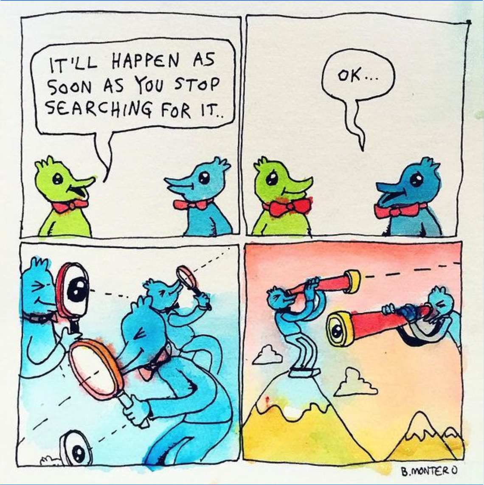

The common thread among my best-performing tweets are that I thought about them for max 90 seconds, figured "eh what the hell", and blasted them out, not remotely expecting them to do well.

There's a level of "the harder you try the further you'll be from success" to a number of things. Going to keep some notes and observations here about that.

## Flirting

## Networking

Going in with an ask doesn't work, but having a fun and interesting conversation with an ask at the end can be super lucrative.

There's an element of [[word magic]] to tasks requiring Reversed Effort–if you can simply convince yourself that you're able to accomplish something, then you will be.

---
### Sources, resources, links

The [Aldous Huxley quote](https://www.awakin.org/read/view.php?tid=100)