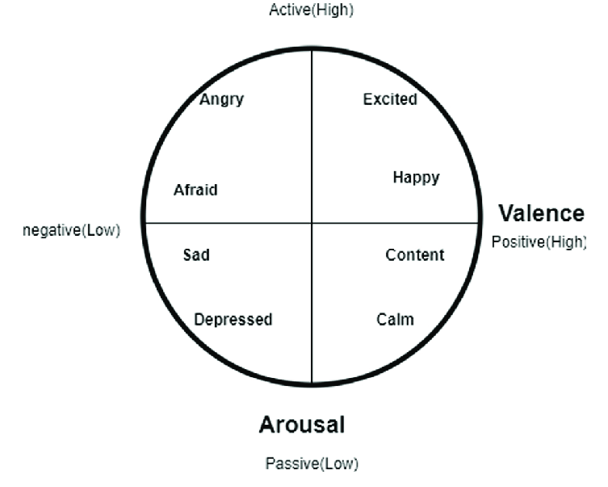

I have fun sometimes. I don't have a very strong framework for defining it. This [great vox article](https://www.vox.com/the-goods/21523704/fun-quarantine-home) by Rachel Sugar addressed the feeling I'd had for a while in quarantine: that fun had become nearly impossible to find. Here's their breakdowns of what makes things fun.

#Standards for something to be fun:

1. Hedonically engaging
2. Liberating

What do these two things mean?

## The valence-arousal model

According to behavioral psych, anything on the right side of the chart can count as 'hedonically engaging' -- e.g. reading a book and attending a metal concert can both be engaging in a hedonic 'pleasure' sense.

The article notes that doing something new (like maybe adding something to your [[secret bucket list]]) is more likely to be pleasurable and engaging, and to **absorb** you in the activity, which is important for the second criteria.

## Liberating

To be fun, something must release you from something: work, social expectations, your own self-discipline. This means that:

- work can never technically be fun. Engaging or meaningful, sure. Not fun.

- boundaries are important. (e.g. this is not a good way to have fun )
	- this does make me think that being able to [[unplug]] seriously improves your odds of having fun

- leisure and fun are not synonymous, but leisure time is important because it creates space for fun things

- I see this as another piece of evidence that the things you [[focus on]] will determine whether you're able to have fun

## The quarantine conclusion

Sugar arrives at the conclusion that things are no longer fun in quarantine because release is impossible. Things that might have been fun before are

> "an exercise in planning -- what is an equidistant park, is there a bathroom, will it rain? ... Instead of fun, release is yet another obligation."

---
### Sources, resources, links

This [vox article](https://www.vox.com/the-goods/21523704/fun-quarantine-home) is the basis of most of this.