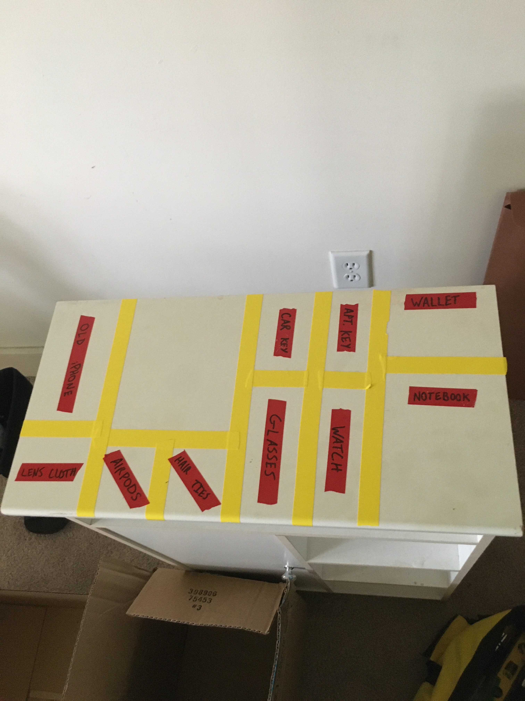

## Following the Fear

This is a lot more straightforward when you've got a therapist there to ask the questions, but you can definitely apply it yourself. The basic gist is to first ask yourself the question:

> What am I afraid of?

And once you've got an answer to that, repeatedly ask,

> So if what I'm afraid of is/becomes true, then what?

You more or less do this until you've arrived at a final conclusion. The realization in most cases is that the conclusion is not as bad as your level of initial fear would've led you to believe.

### An example

Traveling makes me extremely anxious. Anytime I have a flight, I cannot sleep the night before.

> What am I afraid of?

Something unexpected, like an accident on the road or a random problem going through security, will delay me.

> If that happens, what occurs next?

I may miss my flight.

> And?

I will have to find another flight OR I may have to cancel my trip.

> What if you have to find another flight?

I will have to make some phone calls or talk to somebody at a desk, plus spend more money.

> How painful are those possibilities?

I don't love them, but it's not that bad. I won't go broke over another flight.

> What about canceling the trip?

I would be disappointed, but my health/wellbeing/security don't rely on this trip.

### Conclusion

A lot of fears become feelings onto themselves, rather than having any root in the material world. Once we follow that fear down to its roots, we find that a defined consequence is not as dire as the immaterial *what if*.

## The Launchpad

This is one that I actually started doing by myself, but learned later from a therapist was a real strategy. Essentially, you just maintain a surface in your living area that is the explicit home of your every day carry (EDC).

Everybody's EDC is different, but it often includes:
- a wallet
- a phone
- keys
And depending on who you are, you might also have:
- glasses
- a watch
- chapstick
- headphones
- a notebook
- a pen
- etc.

Ideally, the launchpad lives someplace close to your front door, or perhaps in your bedroom. The goal is that the items that you need each day and that tend to live on your person are never misplaced, because they only exist in your pocket or on the launchpad. You pick them up from the launchpad more or less first thing in the morning, and they are returned to the launchpad when you return home in the evening, or when you go to bed.

Personally, I get a lot of satisfaction from having size-specific labeled areas on my launchpad, but that's a personal preference. Here's a crappy little particle-board side table I was using as my launchpad my third year of undergrad:

---
### Sources, resources, links

[A post](https://www.additudemag.com/slideshows/how-to-simplify-life-with-adhd-organization/#:~:text=Create%20a%20Launch%20Pad,soon%20as%20you%20get%20home.) from an ADHD blog that mentions the launch pad.

