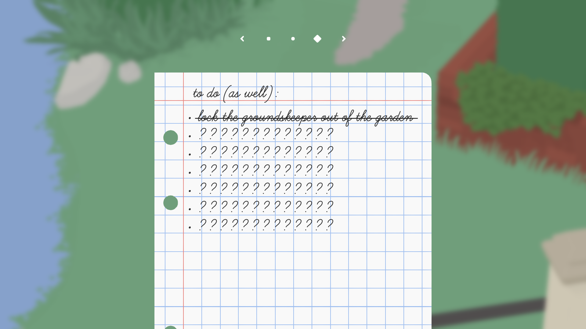

If you've played more than a couple of video games, you're probably familiar with the concept of hidden objectives. (If you aren't, don't worry—we won't spend too long in this metaphor.) Somewhere alongside your list of known goals and potential achievements is a list that looks like this:

Or perhaps the bullets are just blank, or maybe covered over, or don't even appear until you've done whatever it is they're waiting for you to do. Unlike your typical objectives for the level/mission/etc, hidden objectives don't tell you what it is you need to do; you just know they're there to be done.

The goal of hidden objectives is to reward exploration. Rather than being given a list of things to accomplish, players must look at the game itself and ask the question "I wonder whether I can ____". When the answer to that question is yes, the game rewards your curiosity.

As we all know, life imitates Video Games™. So what does the secret objective have to teach us about living our normal human lives?

## Bucket Lists

I was shocked to learn that the phrase 'bucket list' originated with a 2007 movie of the same name. The concept feels so culturally ingrained, I would've sworn it was at least as old as I am, probably older. But no, the internet has assured me that it began with a mixed-review (44% and 71% on [Rotten Tomatoes](https://www.rottentomatoes.com/m/bucket_list)) comedy-drama starring Morgan Freeman and Jack Nicholson about two cancer patients crossing items off a life-long to-do.

It's certainly a compelling idea. Name out all the things you want to do and experience with your life. What will make you feel incomplete if you don't get around to it before your time runs out? Like the visible objectives in our video game parallel, a bucket list lets you prioritize your goals and get started on achieving them. But this post isn't about bucket lists.

> A bucket list has one gigantic limiting factor: you need to know what you want

This isn't to say that people never know themselves or their desires (although I do feel that's a bit rare), but rather to assert that life is chock-full of pleasant surprises. It'd be impossible to try to list everything you'd enjoy, much less everything you *might* enjoy.

If this seems iffy, think about how many areas exist where we fully accept that we don't know what we want or what options we have until we see them in front of us: career fairs, Netflix's recommended page, the menu at The Cheesecake Factory (seriously that thing is a tome of surprises.)

If you google 'bucket list' you'll find countless blogs touting recommendations for items to add. Exotic travel, adrenaline-pumping stunts, and various forms of philanthropy dot these sites and articles. (Also, random side note, but almost every single one of them mentions yoga in some form, idk why.) Having a lot of recommendations is helpful, perhaps, but still doesn't get us a perfect bucket list. So instead, I am proposing an addition to the lexicon:

# 🎉 The Secret Bucket List 🎉

(Ok, not much of a surprise since it's the title of the post.)

The Secret Bucket List (SBL) is akin to the hidden objectives we talked about at the outset of our discussion. Your SBL is a secret **to you.** You don't know that a place, activity, or experience is out there waiting for you, but when you find it, you can recognize that it's significant. Much like the hidden objectives in a video game, it's not possible to know the items that are on your secret bucket list until after you have accomplished them. And just like items on a normal bucket list, Secret Bucket List items are things that make your life feel richer, more interesting, and more fully-lived.

> ### Quick Anecdote:
> My second year of undergrad, I was looking for a low-commitment class to round out my schedule. I landed on a rock-climbing class, because it met infrequently, was pass/fail, and I figured it's never a bad thing to get a little exercise. Less than a year later, I was climbing regularly twice a week, in the best shape I'd ever been, and having a blast. I didn't go looking for a new hobby/passion, I just needed a class for my semester schedule. But giving an "eh, why not" to something new and kind of intriguing ended up morphing into a major milestone. Such is the impact of the Secret Bucket List.

So if Secret Bucket Lists really are secret, how does one find experiences to add to them? While it's not possible to wake up in the morning and decide "I'll cross something off my Secret Bucket List today," there are certainly ways to ensure that you encounter opportunities more often than not.

- Surround yourself with people doing interesting things (aka [[Know Cool People]])
- See vacuums as an opportunity for exploration
- Most importantly: don't be afraid to ask, and always try to say yes

Just like in our video game metaphor, the secret to unlocking hidden objectives is not to try and hunt them down, but rather to look at everything a game gives you and wonder *what can I do with this?* The SBL is about identifying and taking advantage of cool and unique opportunities.

There are a few reasons that a Secret Bucket List can add value to your life.

### Having more experiences is good for its own sake

(I promise I am not receiving money from Big Study Abroad to say this.)

I don't assume there are many people who would refute this point. Having a greater variety of experiences in your life is pretty broadly accepted as a good thing. Having diverse experiences makes you a better-rounded and more interesting person, with more to talk and think about.

### More overall experiences means more good experiences

There's a law-of-averages math thing here that I have really been struggling to write out. So I'm just going to make it as explicit as possible with a little example.

Let's say that every person has an 'enjoyment rate', `y`, that is the percentage of experiences (out of all possible experiences) they'll enjoy. Let's say that I'm easy to please, so my `y` is 0.8. This means that if there's a trillion possible human experiences (lowballing that) I would enjoy 800 billion of them, and not like 200 billion of them.

Let's put in another variable, for number of new experiences per some amount of time (let's say a year) and call that variable `tr`. This means the number of experiences you enjoy in a year could be represented as:

`tr•y` = number of enjoyed experiences

Now there's plenty of different approaches to maximizing our product, but probably the simplest is by making `tr` bigger. Another possible approach would be increasing `y` by strategically choosing things you're more likely to enjoy, but then we run into an issue with...

### More surprises means fewer expectations, means more happiness

If we accept Tom Magliozzi's formula of **"happiness equals reality minus expectations"** then in order to be happier, we should strive to go into situations with minimal expectation. There are few situations where we can change our reality, so it's better to focus on the half of the equation we can affect. That means doing things where *we don't know* what to expect.

## "Charlie, this sounds the same as just *trying new things"*

Ok, very fair point. However, trying new things has a counterintuitive issue:

> When you're too intentional about having a 'new' experience, you're less likely to find a Secret Bucket List item

Secret Bucket Lists are populated when you're curious and open to things, not when you're trying to 'be adventurous' or 'get outside your comfort zone' because those come pre-loaded with expectations.

Below, I've corresponded some of the shortcomings of trying new things with the ways they inform our process of finding Secret Bucket List items.

	

		<h3>Issues with 'trying new things'</h3>
		<ol>
			<li> <b>Too based in what you already like</b> -- If you choose a new experience that's too close to what you already like, there's no stretch/growth/discovery, which is the point of trying new things. </li>
			<li> <b>Judged too quickly</b> -- Whether you're trying a new food or traveling someplace off the beaten path, we're wired to categorize, which can diminish the experience's impact, especially if the judgment happens very quickly (another risk of expectations). </li>
			<li> <b> Novelty for novelty's sake</b> -- When you're trying something new "just to try it" you've more or less said "this won't be meaningful beyond its newness" and that's extremely limiting. </li>
			<li> <b>Quirky and random BS</b> -- If you grab something literally at-random off a travel blog or recipe website or what-have-you, your odds of enjoying it are much lower than if you allow the [[know cool people|people around you to be your suggestion algorithm]]. </li>
		</ol>
	

	

		<h3>SBL items fix it with:</h3>
		<ol>
			<li><b>Just outside of your normal</b> -- SBL items aren't far-flung from your normal (see bullet 4) but they offer enough of a challenge or shakeup to surprise you.</li>
			<li> <b>Openness to more than 'good' or 'bad'</b> -- As we'll discuss in a moment, SBL items don't have to be good (or even neutral) to be SBL items.</li>
			<li> <b>Potential expansion of your self-story</b> -- Without pre-judging an SBL item as a frivolous/one-off/unimportant thing, you give it the opportunity to change the way you see things/yourself and that's good!</li>
			<li> <b>Based on your networks and resources</b> -- If you trust your friends (and you should) then some of your best SBL experiences are likely to come from saying 'yes' to something they suggest. At the very least, this tenant makes the cost of exploration a lot lower.</li>
		</ol>
	

If you're not satisfied with that explanation, maybe you're right, and I am just talking about trying new things. At the very least, the Secret Bucket List might be a valuable retrospective tool to think about the new things you've tried.

## SBL experiences don't need to be good; some of them won't be

I don't have a ton more to say about this, but it's a worthwhile point: doing things where you aren't certain of the outcome is risky. Some of the experiences you pursue thinking they might be Secret Bucket List additions may go horribly wrong. However, something going horribly wrong can also wind up on the Secret Bucket List. For instance, I once tried to go icefishing in Minnesota, but instead I got stranded in the middle of Indiana with a broken down car. The latter is still a good story, and still adds knowledge and value to my overall human existence, even if it did so in a way that was pretty painful and disappointing at the time.

In the case of bad experiences that are nonetheless valuable, we see the Secret Bucket List intersect with the [[School of Hard Knocks]].

---

# Some additional posts that will eventually flesh out the concept

What holds us back from discovering SBL items

My personal secret bucket list, explained

> special thanks to Salem Zelalem for reading this post in its early stages