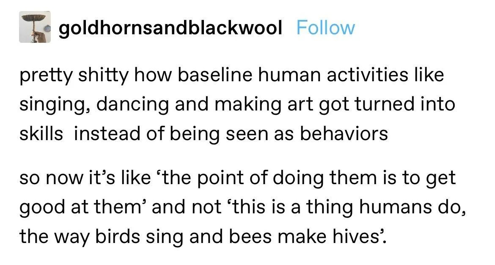

You don't have to be good at stuff! And you never have to improve at it, either! You can just do it for fun and be bad!

This is related to [[sucking]] but with a different motivation.

When it feels like life is [[transactional]], it's much harder to find it acceptable to be bad at something.

---
### Sources, resources, links

A [blog post](https://www.xaprb.com/blog/worth-doing-badly/) that I originally cited in the post about Sucking at Stuff, but is more about this.