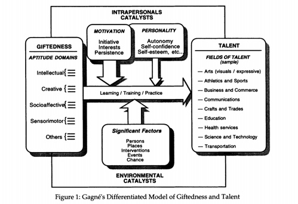

Does it???

## Talent as Curiosity

Talent in many ways comes around as a result of a willingness to learn.

## Curiosity Can Require Positive Feedback

It's hard to spend a lot of time [[sucking]] at something and not enjoying an activity as a result.

---
### Sources, resources, links

Francoys Gagne's [Differentiated Model of Giftedness and Talent](https://education.nt.gov.au/__data/assets/pdf_file/0007/438883/Gifted-and-Talented-Education-policy_Appendix-9_EDOC2016-7113.pdf)